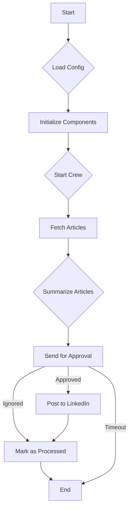

# Product Architecture

This document provides a detailed overview of the LinkedIn Posting Agent's architecture, components, and workflow.

## 1. System Overview

The LinkedIn Posting Agent is a Python-based application designed to automate the process of finding, summarizing, and posting trending AI articles to LinkedIn. It uses a combination of web scraping, AI-powered summarization, and browser automation to achieve its goals. The agent is designed to be modular, extensible, and easy to maintain.

## 2. Core Components

The agent is composed of the following core components:

*   **`main.py`**: The entry point of the application. It initializes the other components and starts the main processing loop.
*   **`config.py`**: Handles the loading and validation of configuration settings from a `.env` file.
*   **`src/crew.py`**: Defines the CrewAI agents, tasks, and crew that orchestrate the entire workflow.
*   **`src/article_fetcher.py`**: Responsible for fetching articles from various sources, including Hacker News, Reddit, TechCrunch, and ArXiv.
*   **`src/llm_handler.py`**: Interacts with the Google Gemini LLM to generate summaries of the articles.
*   **`src/telegram_bot.py`**: Manages communication with the user via Telegram, including sending articles for approval and handling user responses.
*   **`src/linkedin_poster.py`**: Handles the process of posting articles to LinkedIn using Selenium.
*   **`src/database.py`**: Manages the SQLite database used to store information about processed articles.
*   **`src/utils.py`**: Contains utility functions, such as logging setup.

## 3. Workflow

The agent follows this end-to-end workflow:

1.  **Initialization**: The `main.py` script initializes the application by loading the configuration and setting up the core components.
2.  **Crew Execution**: The `crew.py` script is executed, which kicks off the CrewAI workflow.
3.  **Fetch Articles**: The `ArticleFetcherAgent` fetches trending AI articles from the configured sources.
4.  **Summarize Articles**: The `SummarizerAgent` generates a concise summary for each article using the Gemini LLM.
5.  **Request Approval**: The `TelegramBot` sends the article title, source, summary, and link to the user for approval.
6.  **Post to LinkedIn**: If the user approves the article, the `LinkedInPosterAgent` posts it to LinkedIn.
7.  **Mark as Processed**: The `Database` component is updated to mark the article as processed, preventing it from being sent for approval again.
8.  **Repeat**: The process repeats based on the configured schedule.
